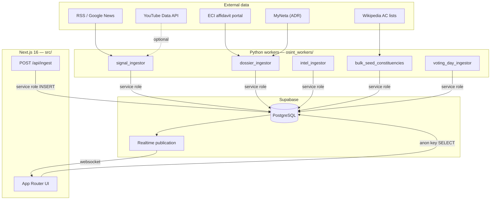
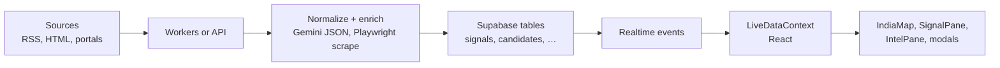
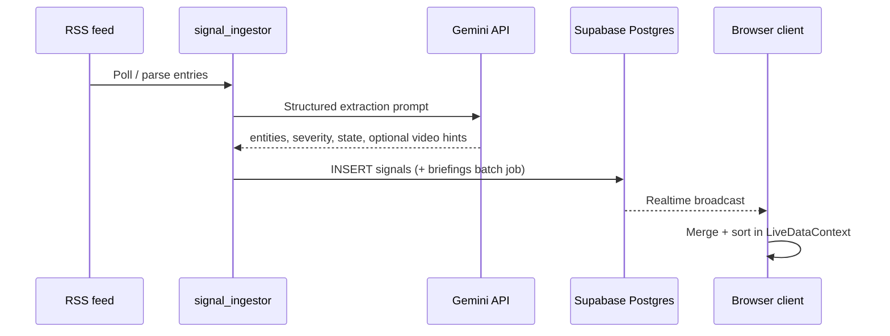

<div align="center">

# Dharma-OSINT

### Situational awareness for Indian state elections

**Open-source intelligence dashboard** that fuses regional news signals, verified candidate dossiers (ECI + ADR MyNeta), and geospatial context into a single tactical view—built for analysts, journalists, and researchers.

<br />

[](https://nextjs.org/)
[](https://react.dev/)
[](https://www.typescriptlang.org/)
[](https://supabase.com/)
[](https://www.python.org/)

<br />

[Architecture](#architecture) · [Data pipelines](#data-pipelines) · [Features](#features) · [Recent updates](#recent-updates) · [Install](#installation) · [Configuration](#configuration) · [Workers](#python-workers-osint_workers) · [API](#http-ingest-api) · [Contributors](#contributors)

</div>

---

## Why this exists

Election coverage is fragmented across portals, PDF affidavits, and firehose news. **Dharma-OSINT** centralizes:

1. **Signals** — time-stamped OSINT items (severity, state, optional geo, verification hints) derived from RSS and LLM structuring.
2. **Dossiers** — candidates linked to constituencies with ECI affidavit URLs and MyNeta-style asset / criminal-case fields where available.
3. **Map-first UI** — constituencies on an India basemap with volatility and “hotspot” style overlays driven by live data.

The stack is deliberately boring where it matters (**Postgres + Row Level Security + Realtime**) and expressive where it helps (**Gemini** for extraction and briefings).

---

## Architecture

### System context

High-level view of how browsers, the Next.js app, Supabase, and Python workers relate to external data sources.



### End-to-end data flow

From raw feeds to pixels on the map.



### Signal path (conceptual sequence)



---

## Data pipelines

| Layer | What runs | Where it lands | Notes |
|--------|-----------|----------------|--------|
| **Geography seed** | `bulk_seed_constituencies.py` | `constituencies` | Scrapes Wikipedia tables; uses Gemini to structure rows + approximate centroids. Run before dossiers if IDs must exist. |
| **Dossier** | `dossier_ingestor.py` | `candidates` | Playwright + BeautifulSoup on **affidavit.eci.gov.in**; then MyNeta HTML enrichment and fuzzy name matching. Marks stale rows `removed` when absent from latest ECI pass. |
| **Signals** | `signal_ingestor.py` | `signals`, `briefings` | Multi-feed RSS; Gemini (`google-genai`) for extraction; optional YouTube attachment when `YOUTUBE_API_KEY` is set. Prunes old signals (24h policy in code—check script). |
| **Volatility** | `intel_ingestor.py` | `constituencies.volatility_score` | Deterministic 0–100 index from contest size, criminal-case caps, and recent signal severity (14-day lookback). |
| **Voting day** | `voting_day_ingestor.py` | `voter_turnout`, `exit_polls`, related | Scheduled IST windows: live/final turnout (Gemini + optional ECINet batch), exit-poll RSS/LLM. **ECI final PDF:** pass `--link <https://…pdf>` or set `ECI_PRESS_PDF_URL` after polls close — see `eci_press_release.py`. |
| **HTTP ingest** | `POST /api/ingest` | `signals` | Next route uses **Gemini 1.5 Flash** server-side; optional `INGEST_SHARED_SECRET` header for lockdown. |

**Important:** With RLS enabled, **workers must use `SUPABASE_SERVICE_ROLE_KEY`** for writes. The public **anon** key is for read-only dashboard access.

---

## Features

### Dashboard (Next.js)

- **War-room style UI** — dark tactical chrome, dense panels, mode driven by `NEXT_PUBLIC_OPERATION_MODE` (e.g. pre-poll vs live phases).
- **India map** — SVG geography via **react-simple-maps** + **d3-geo**; constituencies colored using volatility and state filters.
- **Signal stream** — cards with severity, verification, geography when present; “hotspots” use recent signals with `constituency_id` in scope.
- **Intel / candidates** — rows and modals for candidate dossiers (party, assets, criminal cases, ECI/MyNeta links).
- **Live updates** — `LiveDataContext` subscribes to Supabase Realtime on `constituencies`, `candidates`, `signals`, `briefings`, `voter_turnout`, `exit_polls`, `live_results`.
- **War room turnout HUD** — Official vs web snapshot badges with **high-contrast** ECI styling in light and dark themes. **Booth news** shows short field-style lines on each state’s **poll calendar day (IST)** only (no source link list in the panel).
- **Footer** — Status strip (signals / constituencies / candidates counts); operation mode is **not** shown as a bottom-bar chip (reduces clutter).

### Security model (summary)

- **RLS:** `anon` / `authenticated` = **SELECT only** on public tables; **no** client-side inserts for production OSINT.
- **Service role:** Workers and server routes that need `INSERT` / `UPDATE` use the service key **only on the server** (never `NEXT_PUBLIC_*`).
- **Ingest hardening:** Set `INGEST_SHARED_SECRET` and send `x-ingest-secret: <value>` or `Authorization: Bearer <value>` to `/api/ingest`.

---

## Recent updates

Summary of notable changes (war room, workers, and repo hygiene):

| Area | Change |
|------|--------|
| **ECI press PDF** | `eci_press_release.py` is **direct-URL only**: Playwright downloads the PDF you provide, `pypdf` extracts text, Gemini parses turnout, Supabase upserts. No press listing, ECINet table scrape, or encrypted list API. |
| **CLI** | `python voting_day_ingestor.py --link "https://…"` plus `--force-states` or `--eci-press-date` for default states. Optional daemon: `ECI_PRESS_PDF_URL` after **18:30 IST** (disabled with `ECI_SKIP_PRESS_RELEASE=1`). |
| **Gemini config** | Grounded turnout calls no longer pass deprecated `ThinkingConfig(thinking_budget=…)` (compatible with current `google-genai` / Pydantic). |
| **Voting HUD** | Booth news: **text-only** field lines; filters out citation / methodology / encore / turnout-claim rows; **poll-day-only (IST)** per state. ECI pills use **dark green + white text** in light mode for readability. |
| **Bottom bar** | Removed the **MODE: VOTING_DAY** (etc.) chip next to SYS.ONLINE. |
| **Git** | `.gitignore` includes `.eci*` so local ECI/Playwright probe files are not committed. **`git add .` from `osint_workers/` does not stage root files** — run `git add -A` from the **repo root** (`election-osint/`) before commit. |

---

## Tech stack

| Area | Choice |
|------|--------|
| UI | Next.js 16 (App Router), React 19, Tailwind CSS 4 |
| Maps | react-simple-maps, d3-geo |
| Database | Supabase (Postgres, Realtime, RLS) |
| LLM | Google Gemini (workers: `google-genai`; web ingest: `@google/generative-ai`) |
| Workers | Python 3.11+, Playwright, BeautifulSoup, feedparser, supabase-py |

---

## Installation

### Prerequisites

- **Node.js** 20+ (22 LTS recommended; project builds on Next 16)
- **npm** 10+
- **Python** 3.11+
- A **Supabase** project (free tier is fine for experiments)
- **Gemini API** key ([Google AI Studio](https://aistudio.google.com/))

### 1. Clone

```bash
git clone https://github.com/sooryahprasath/election-osint.git
cd election-osint
```

### 2. Frontend dependencies

```bash
npm install
```

### 3. Database schema

1. Open the Supabase project → **SQL Editor**.
2. Run the canonical script: **`db_schema_06042026.sql`**.

**Heads-up:** The file begins with `DROP TABLE … CASCADE` for a **clean slate**. For an **existing** database with data you care about, do **not** run the drops blindly—apply only the sections you need (indexes, RLS, publication, comments) or migrate via `supabase db diff` / manual ALTERs.

After apply, confirm **Realtime** includes the tables listed in that file (publication `supabase_realtime`). Re-running `ALTER PUBLICATION … ADD TABLE` may error if already added; that is safe to ignore.

### 4. Python workers

```bash
cd osint_workers
python -m venv .venv

# Windows
.venv\Scripts\activate
# macOS / Linux
source .venv/bin/activate

pip install -r requirements.txt
playwright install chromium
```

### 5. Environment variables

Create **`.env`** in the **repository root** (same level as `package.json`). Workers load this path explicitly.

| Variable | Required | Used by |
|----------|----------|---------|
| `NEXT_PUBLIC_SUPABASE_URL` | Yes | Web app, workers |
| `NEXT_PUBLIC_SUPABASE_ANON_KEY` | Yes | Web app (browser reads) |
| `SUPABASE_SERVICE_ROLE_KEY` | Yes for ingest | Workers, `getServiceSupabase()` in API routes |
| `GEMINI_API_KEY` | Yes for AI paths | Workers, `/api/ingest` |
| `INGEST_SHARED_SECRET` | Recommended in prod | Locks `POST /api/ingest` |
| `YOUTUBE_API_KEY` | Optional | `signal_ingestor` video attachment |
| `NEXT_PUBLIC_OPERATION_MODE` | Optional | UI mode string (default `PRE-POLL`) |

**Next.js** also reads `.env.local` if you prefer splitting secrets; workers still expect root `.env` unless you change paths in scripts.

Example (placeholders only):

```env
NEXT_PUBLIC_SUPABASE_URL=https://xxxx.supabase.co
NEXT_PUBLIC_SUPABASE_ANON_KEY=NiIsIneyJhbGciOiR5cCI6IkpXVCJ9JIUzI1...
SUPABASE_SERVICE_ROLE_KEY=eiOpXVCJIsIniJJIsIniJIUzI1IkR5cCI6...
GEMINI_API_KEY=your_gemini_key
INGEST_SHARED_SECRET=long-random-string
# YOUTUBE_API_KEY=
```

### 6. Run the app

```bash
# from repo root
npm run dev
```

Open [http://localhost:3000](http://localhost:3000). The dev server uses Turbopack (`next dev --turbopack`).

Production build:

```bash
npm run build
npm start
```

### 7. Run workers (playbook)

Typical **first-time** order:

```bash
cd osint_workers
source .venv/bin/activate   # or .venv\Scripts\activate on Windows

# 1) Seed constituencies (Gemini + Wikipedia)
python bulk_seed_constituencies.py

# 2) ECI + MyNeta dossier pass (browser visible by default for Playwright)
python dossier_ingestor.py
#    Or:  python dossier_ingestor.py --eci-only
#         python dossier_ingestor.py --myneta-only
#         python dossier_ingestor.py --eci-headless
#         python dossier_ingestor.py --myneta-visible   # show MyNeta Chromium

# 3) Continuous or scheduled signals
python signal_ingestor.py

# 4) Volatility index (cron hourly is sensible)
python intel_ingestor.py --once
```

**Voting-day automation:**

```bash
python voting_day_ingestor.py --once
# See module docstring for IST schedule and flags.

# ECI final-turnout PDF (direct URL — Playwright + Gemini + DB upsert)
python voting_day_ingestor.py --link "https://www.eci.gov.in/.../download?..." --force-states Kerala Assam Puducherry
# Optional: ECI_PRESS_PDF_URL in .env for the long-running daemon after 18:30 IST
```

---

## HTTP ingest API

`POST /api/ingest`

- **Body:** JSON with at least `summary` or `body`, plus `title`, `source` as available.
- **Behavior:** Server calls Gemini, validates coarse India bounding for coordinates, inserts into `signals` with **service role**.
- **Auth:** If `INGEST_SHARED_SECRET` is set, send header `x-ingest-secret: <secret>` or `Authorization: Bearer <secret>`.

Example:

```bash
curl -X POST http://localhost:3000/api/ingest \
  -H "Content-Type: application/json" \
  -H "x-ingest-secret: YOUR_SECRET" \
  -d '{"source":"manual","title":"Test","summary":"Kerala polling calm in Kannur."}'
```

---

## Development

| Command | Purpose |
|---------|---------|
| `npm run dev` | Local dev (Turbopack) |
| `npm run build` | Production build |
| `npm run lint` | ESLint |
| `npm test` | Vitest |

---

## Repository layout (abbreviated)

```text
election-osint/
├── db_schema_06042026.sql    # Canonical Postgres + RLS + Realtime publication
├── src/
│   ├── app/                    # App Router pages + /api/ingest
│   ├── components/             # Map, signals, intel, chrome
│   └── lib/                    # Supabase clients, LiveDataContext
├── osint_workers/
│   ├── requirements.txt
│   ├── signal_ingestor.py
│   ├── dossier_ingestor.py
│   ├── intel_ingestor.py
│   ├── bulk_seed_constituencies.py
│   ├── voting_day_ingestor.py
│   └── eci_press_release.py    # Direct PDF URL → turnout upsert
├── package.json
└── README.md
```

---

## Contributors

- **[sooryahprasath](https://github.com/sooryahprasath)** 
- **[justin-aj](https://github.com/justin-aj)** 

Add yourself via PR if you’ve contributed meaningfully and would like to be listed.

---

## Contributing

Issues and PRs are welcome. Please:

- Keep **secrets out of git** (never commit `.env`).
- Match existing **RLS posture**: do not expose the service role to the browser.
- Run **`npm run build`** and relevant workers against a **throwaway** Supabase project when possible.

---

## Disclaimer

This software is for **research and transparency**. News and third-party sites may have terms of use; **respect robots.txt, rate limits, and local law**. Scrapers can break when upstream HTML changes. You are responsible for how you deploy and what you store.

---

## Acknowledgements

- **Election Commission of India** — public affidavit portal.
- **ADR / MyNeta** — candidate disclosure ecosystem.
- **Supabase** — hosted Postgres and Realtime.
- **Google Gemini** — structuring and briefings.

---

<div align="center">

**Built for clarity under noise — Dharma-OSINT**

</div>
