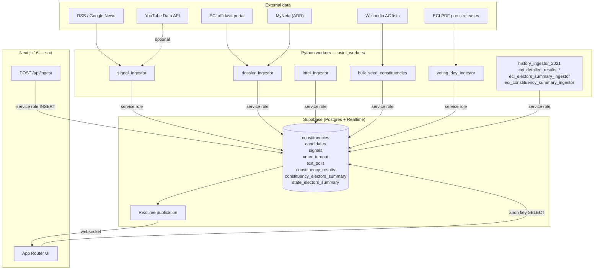
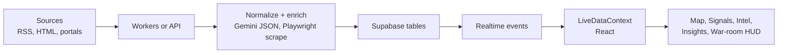

<div align="center">

# Dharma-OSINT

### Situational awareness for Indian state elections 2026

**Open-source intelligence dashboard** that fuses regional news signals, verified candidate dossiers (ECI + ADR MyNeta), and geospatial context into a single tactical view — built for analysts, journalists, and researchers.

<br />

[](https://nextjs.org/)
[](https://react.dev/)
[](https://www.typescriptlang.org/)
[](https://supabase.com/)
[](https://www.python.org/)

<br />

[Architecture](#architecture) · [Data pipelines](#data-pipelines) · [Features](#features) · [Install](#installation) · [Configuration](#configuration) · [Workers](#python-workers-osint_workers) · [Voting day runbook](#voting-day-runbook) · [API](#http-ingest-api) · [Security](#security-model)

</div>

---

## Why this exists

Election coverage is fragmented across portals, PDF affidavits, and firehose news. **Dharma-OSINT** centralises:

1. **Signals** — time-stamped OSINT items (severity, state, optional geo, verification hints) derived from RSS and LLM structuring.
2. **Dossiers** — candidates linked to constituencies with ECI affidavit URLs and MyNeta-style asset / criminal-case fields.
3. **Insights** — historical 2021 election results, seat-level elector gender data, constituency breakdowns, and cross-state analytics.
4. **Map-first UI** — constituencies on an India basemap with volatility and "hotspot" overlays driven by live data.

The stack is boring where it matters (**Postgres + Row Level Security + Realtime**) and expressive where it helps (**Gemini** for extraction, briefings, and LLM-assisted scraping).

---

## Architecture

### System context



### End-to-end data flow



---

## Data pipelines

| Layer | Script | Table(s) | Notes |
|-------|--------|----------|-------|
| Geography seed | `bulk_seed_constituencies.py` | `constituencies` | Scrapes Wikipedia tables; Gemini structures rows + approximate centroids. Run once before dossiers. |
| Dossier | `dossier_ingestor.py` | `candidates` | Playwright on **affidavit.eci.gov.in** + MyNeta HTML enrichment + fuzzy name matching. Marks stale rows `removed`. |
| Signals | `signal_ingestor.py` | `signals`, `briefings` | Multi-feed RSS; Gemini extraction; optional YouTube. Prunes signals older than 24 h. |
| Volatility | `intel_ingestor.py` | `constituencies.volatility_score` | 0–100 index from contest size, criminal cases, and signal severity (14-day lookback). |
| 2021 history | `history_ingestor_2021.py` | `constituency_results` | Wikipedia-sourced results (winner/runner-up/margin/turnout). ECI XLSX overrides via `eci_detailed_results_xlsx_ingestor.py`. |
| 2021 electors (state) | `eci_electors_summary_ingestor.py` | `state_electors_summary` | ECI "Electors Data Summary" XLSX per state. |
| 2021 electors (seat) | `eci_constituency_summary_ingestor.py` | `constituency_electors_summary` | ECI "Constituency Data Summary" CSV per state. Requires `constituency_results_migration.sql` first. |
| Voting day | `voting_day_ingestor.py` | `voter_turnout`, `exit_polls` | IST-scheduled: live/final turnout (Gemini + optional ECINet batch), exit-poll RSS/LLM. ECI final PDF via `--link` or `ECI_PRESS_PDF_URL`. |
| HTTP ingest | `POST /api/ingest` | `signals` | Next.js route — Gemini 1.5 Flash; optional `INGEST_SHARED_SECRET` lockdown. |

**Important:** Workers must use `SUPABASE_SERVICE_ROLE_KEY` for writes. The `anon` key is read-only via RLS. If only the anon key is present the worker will warn and all writes will fail.

---

## Features

### Dashboard tabs

| Tab | What it shows |
|-----|---------------|
| **INSIGHTS** (default) | Historical 2021 results · seat share arcs · electoral breakdowns · candidate analytics · global / state / constituency scope |
| **SIGNALS** | Live OSINT feed — severity, geo, verification status; AI briefing panel |
| **INTEL** | Candidate dossiers — assets, criminal cases, constituency card with 2021 incumbent data |
| **MAP** | SVG India basemap; constituencies colored by volatility; hotspot overlay |
| **VIDEOS** | YouTube clips linked to signals |
| **POLLS** | Opinion polls pane |
| **VOTING LIVE** | War-room turnout HUD — ECI numbers, booth news, exit-poll bands (after embargo lift) |

### Insights tab — analytical panels

- **ALL scope**: global KPI bar · seat-share arcs per state · criminal share · top assets by state · closest seats · tight seats · winning-party turnout distribution
- **State scope**: state KPIs · seat-share arc · competitive seats list · candidate filings · age/gender breakdowns · top assets · electors gender (state-level)
- **Constituency scope**: seat snapshot (2021) · pinned mini-map (zoomed, fills card) · electors gender (seat-level when available) · constituency breakdown (winner/runner-up photos, margin, votes polled) · candidate filings · age/gender · electoral insights

### Security model

- **RLS:** `anon` / `authenticated` = SELECT only on public tables. No client-side inserts.
- **Service role:** Used only server-side (workers and `/api/ingest`) — never in `NEXT_PUBLIC_*`.
- **Ingest hardening:** Set `INGEST_SHARED_SECRET`; send as `x-ingest-secret: <value>` or `Authorization: Bearer <value>`.
- **Prompt injection mitigation:** `/api/ingest` caps `source` (200 chars), `title` (400 chars), `body` (6 000 chars) before LLM prompt interpolation.
- **Auth before body:** The `/api/ingest` route checks the secret header before reading the request body.

---

## Tech stack

| Area | Choice |
|------|--------|
| UI | Next.js 16 (App Router), React 19, Tailwind CSS 4 |
| Maps | react-simple-maps, d3-geo |
| Database | Supabase (Postgres, Realtime, RLS) |
| LLM | Google Gemini (workers: `google-genai`; web ingest: `@google/generative-ai`) |
| Workers | Python 3.11+, Playwright, BeautifulSoup, feedparser, supabase-py |
| Tests | Vitest |

---

## Installation

### Prerequisites

- **Node.js** 20+ (22 LTS recommended)
- **npm** 10+
- **Python** 3.11+
- A **Supabase** project (free tier is fine)
- **Gemini API** key ([Google AI Studio](https://aistudio.google.com/))

### 1. Clone

```bash
git clone https://github.com/sooryahprasath/election-osint.git
cd election-osint
```

### 2. Frontend dependencies

```bash
npm install
```

### 3. Database schema

1. Open your Supabase project → **SQL Editor**.
2. Run **`db_schema_06042026.sql`** for the base schema.
3. Run **`constituency_results_migration.sql`** for historical results + electors summary tables.
4. Run **`opinion_polls_migration.sql`** if you need the polls pane.

> **Heads-up:** `db_schema_06042026.sql` begins with `DROP TABLE … CASCADE` for a clean slate. On an existing database, apply only the sections you need or use `ALTER` statements.

After apply, confirm **Realtime** includes the tables in that file (publication `supabase_realtime`).

### 4. Python workers

```bash
cd osint_workers
python -m venv .venv

# Windows
.venv\Scripts\activate
# macOS / Linux
source .venv/bin/activate

pip install -r requirements.txt
playwright install chromium
```

### 5. Environment variables

Create **`.env`** in the **repository root** (same level as `package.json`). Workers load this path explicitly.

| Variable | Required | Used by |
|----------|----------|---------|
| `NEXT_PUBLIC_SUPABASE_URL` | Yes | Web app, workers |
| `NEXT_PUBLIC_SUPABASE_ANON_KEY` | Yes | Web app (browser reads) |
| `SUPABASE_SERVICE_ROLE_KEY` | Yes for all writes | Workers, `/api/ingest` — **never expose to browser** |
| `GEMINI_API_KEY` | Yes for AI paths | Workers, `/api/ingest` |
| `INGEST_SHARED_SECRET` | Recommended in prod | Locks `POST /api/ingest` |
| `YOUTUBE_API_KEY` | Optional | `signal_ingestor` video attachment |
| `NEXT_PUBLIC_OPERATION_MODE` | Optional | UI mode (default `PRE-POLL`) |

**Next.js** also reads `.env.local` if you prefer splitting secrets; workers still expect root `.env`.

Example (placeholders only):

```env
NEXT_PUBLIC_SUPABASE_URL=https://xxxx.supabase.co
NEXT_PUBLIC_SUPABASE_ANON_KEY=eyJhbGciOiJIUzI1NiIsInR5cCI6IkpXVCJ9...
SUPABASE_SERVICE_ROLE_KEY=eyJhbGciOiJIUzI1NiIsInR5cCI6IkpXVCJ9...
GEMINI_API_KEY=your_gemini_key
INGEST_SHARED_SECRET=long-random-string
# YOUTUBE_API_KEY=
```

### 6. Run the app

```bash
npm run dev        # Turbopack dev server → http://localhost:3000
npm run build      # Production build
npm start          # Run production build
npm run lint       # ESLint
npm test           # Vitest
```

### 7. Workers playbook (first-time setup)

```bash
cd osint_workers
source .venv/bin/activate   # Windows: .venv\Scripts\activate

# 1) Seed constituencies (Gemini + Wikipedia)
python bulk_seed_constituencies.py

# 2) ECI + MyNeta dossier (browser visible by default)
python dossier_ingestor.py
#    --eci-only | --myneta-only | --eci-headless

# 3) 2021 historical results (XLSX from osint_workers/historical_data/)
python eci_detailed_results_xlsx_ingestor.py

# 4) 2021 electors data — state level (XLSX)
python eci_electors_summary_ingestor.py --year 2021

# 5) 2021 electors data — constituency level (CSV index cards)
python eci_constituency_summary_ingestor.py --year 2021

# 6) Continuous signals
python signal_ingestor.py

# 7) Volatility index (cron hourly)
python intel_ingestor.py --once
```

---

## Voting day runbook

### Schedule (IST)

| Window | Mode | What runs |
|--------|------|-----------|
| 07:00–18:30 | `TURNOUT_LIVE` | Live turnout + booth news (Gemini + Google News RSS, optional ECINet batch) |
| 18:30–19:00 | `TURNOUT_FINAL` | Final turnout pass (flagged `FINAL` in `time_slot`) |
| 19:00–02:00 | `EXIT_POLL` | Exit-poll RSS/LLM — **blocked by embargo until 29 Apr 2026 19:00 IST** |
| 02:00–07:00 | `IDLE` | Long sleep |

### Election calendar 2026

| Date | States |
|------|--------|
| ~~9 Apr 2026~~ | ~~Kerala, Assam, Puducherry~~ (Phase 1 — **done**) |
| **23 Apr 2026** | **Tamil Nadu, West Bengal** (Phase 2) ← **next voting day** |
| 29 Apr 2026 | West Bengal (Phase 2B) |
| 4 May 2026 | Counting day |
| 29 Apr 2026 19:00 IST | Exit-poll embargo lifts |

### Start / stop daemon

```bash
cd osint_workers

# Recommended env (set before starting):
export TURNOUT_NUMBERS_SOURCE=eci
export TURNOUT_INGEST_MODE=grounded
export VOTING_INGEST_INTERVAL_SEC=1200
export ECI_SCRAPE_GRACE_MIN=12

./run_voting_ingestor.sh start    # Starts daemon, writes PID
./run_voting_ingestor.sh status   # Check running
./run_voting_ingestor.sh tail     # Stream log
./run_voting_ingestor.sh stop     # Graceful stop
```

### One-shot test (dry run before the day)

```bash
python voting_day_ingestor.py --once --force-states "Tamil Nadu" "West Bengal"
```

### ECI final-turnout PDF (after polls close)

```bash
# Pass the direct PDF URL — Playwright downloads, Gemini extracts, DB upserts.
python voting_day_ingestor.py --link "https://www.eci.gov.in/.../download?..." \
  --force-states "Tamil Nadu" "West Bengal"

# Or set once in .env for the daemon to pick up automatically after 18:30 IST:
ECI_PRESS_PDF_URL=https://www.eci.gov.in/...
```

### Pre-flight checklist for 23 Apr 2026

- [ ] `SUPABASE_SERVICE_ROLE_KEY` set (not just anon key)
- [ ] `GEMINI_API_KEY` set and has quota
- [ ] `playwright install chromium` done in the venv
- [ ] `python voting_day_ingestor.py --once --force-states "Tamil Nadu" "West Bengal"` completes without errors
- [ ] Database `voter_turnout` table exists (created by `db_schema_06042026.sql`)
- [ ] Set `NEXT_PUBLIC_OPERATION_MODE=VOTING_DAY` before deploying the web app
- [ ] Start daemon at 06:45 IST with `./run_voting_ingestor.sh start`

---

## HTTP ingest API

`POST /api/ingest`

- **Body:** JSON with at least `summary` or `body`, plus `title`, `source`, optional `source_url`.
- **Auth:** If `INGEST_SHARED_SECRET` is set, send `x-ingest-secret: <secret>` or `Authorization: Bearer <secret>`.
- **Behaviour:** Calls Gemini 1.5 Flash server-side; validates India bounding box for coordinates; dedupes by URL (72 h) and simhash (24 h); inserts into `signals` with service role.
- **Drops:** Items with `election_relevance_0_1 < 0.6` are returned with `{ dropped: true }` and not saved.

```bash
curl -X POST https://your-app.vercel.app/api/ingest \
  -H "Content-Type: application/json" \
  -H "x-ingest-secret: YOUR_SECRET" \
  -d '{"source":"manual","title":"TN voting calm","summary":"Polling underway in Chennai districts."}'
```

---

## Repository layout

```text
election-osint/
├── db_schema_06042026.sql              # Canonical Postgres + RLS + Realtime publication
├── constituency_results_migration.sql  # Historical results + electors summary tables
├── opinion_polls_migration.sql         # Opinion polls table
├── src/
│   ├── app/
│   │   ├── page.tsx                    # Root layout, global state, mobile tabs
│   │   └── api/ingest/route.ts         # HTTP ingest API (Gemini + Supabase)
│   ├── components/
│   │   ├── center/
│   │   │   ├── InsightsCenterPane.tsx  # Main insights tab (ALL/state/constituency)
│   │   │   ├── SignalsCenterPane.tsx
│   │   │   └── VideosCenterPane.tsx
│   │   ├── intel/
│   │   │   ├── IntelPane.tsx           # Candidate list + search
│   │   │   ├── CandidateModal.tsx      # Candidate dossier modal
│   │   │   └── ConstituencyCard.tsx    # Constituency card with 2021 incumbent
│   │   ├── map/IndiaMap.tsx
│   │   ├── signals/
│   │   └── warroom/VotingHud.tsx       # War-room turnout HUD
│   └── lib/
│       ├── supabase.ts                 # Browser Supabase client (anon, SELECT)
│       ├── supabase-service.ts         # Server Supabase client (service role, INSERT/UPDATE)
│       ├── context/LiveDataContext.tsx # Global data provider
│       └── utils/
│           ├── countdown.ts            # ELECTION_DATES, embargo lift constant
│           ├── electionTimeline.ts     # Macro phases + intraday war-room steps
│           └── states.ts               # STATE_META (abbr, dbPrefix, color)
├── osint_workers/
│   ├── requirements.txt
│   ├── voting_day_ingestor.py          # Voting day daemon (IST schedule)
│   ├── run_voting_ingestor.sh          # Start/stop/status wrapper
│   ├── signal_ingestor.py
│   ├── dossier_ingestor.py
│   ├── intel_ingestor.py
│   ├── bulk_seed_constituencies.py
│   ├── history_ingestor_2021.py
│   ├── eci_detailed_results_xlsx_ingestor.py
│   ├── eci_electors_summary_ingestor.py
│   ├── eci_constituency_summary_ingestor.py
│   ├── eci_press_release.py            # Direct PDF URL → turnout upsert
│   ├── eci_polling_trend.py            # ECINet Playwright scraper
│   └── historical_data/               # XLSX / CSV source files (not committed by default)
├── scripts/
│   ├── capture-ui.mjs                  # Playwright UI screenshot utility
│   └── check-supabase-env.mjs          # Env var validation helper
├── __tests__/
│   └── formatting.test.ts
└── package.json
```

---

## Development commands

| Command | Purpose |
|---------|---------|
| `npm run dev` | Local dev (Turbopack) |
| `npm run build` | Production build |
| `npm run lint` | ESLint |
| `npm test` | Vitest |

---

## Contributing

Issues and PRs welcome. Please:

- Keep **secrets out of git** — never commit `.env` or `.env.local`.
- Match existing **RLS posture** — do not expose the service role key to the browser.
- Run **`npm run build`** before submitting a PR.
- Workers must be tested against a **throwaway Supabase project** before merging.

---

## Disclaimer

This software is for **research and transparency**. News and third-party sites may have terms of use — respect `robots.txt`, rate limits, and local law. Scrapers can break when upstream HTML changes. You are responsible for your deployment and what you store.

---

## Acknowledgements

- **Election Commission of India** — public affidavit portal and open data.
- **ADR / MyNeta** — candidate disclosure ecosystem.
- **Supabase** — hosted Postgres and Realtime.
- **Google Gemini** — structuring, briefings, and LLM-assisted extraction.

---

## Contributors

- **[sooryahprasath](https://github.com/sooryahprasath)**
- **[justin-aj](https://github.com/justin-aj)**

---

<div align="center">

**Built for clarity under noise — Dharma-OSINT**

</div>
